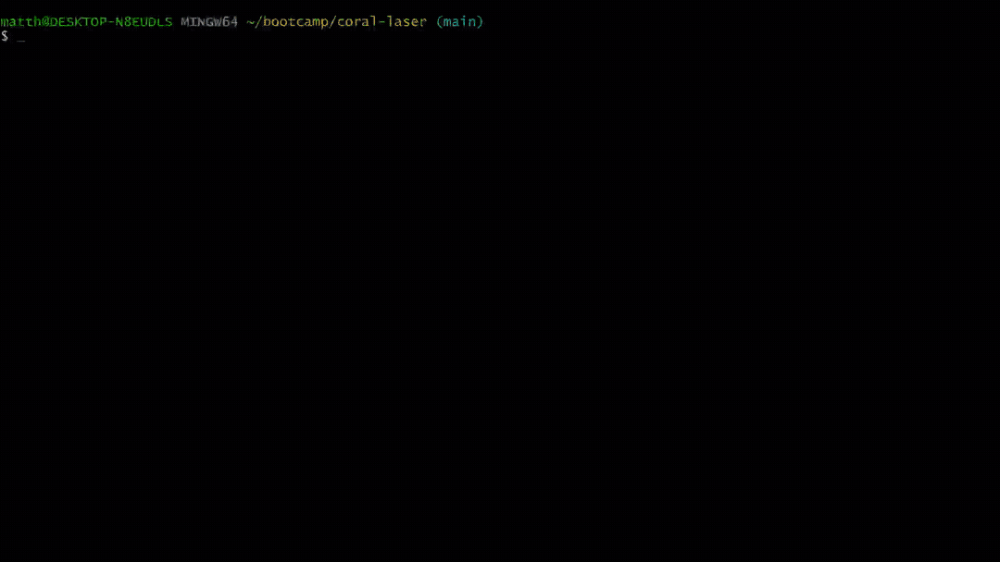

# Employee CMS

## Description
A CMS for managing employee information

## Table of Contents

- [Installation](#installation)
- [Usage](#usage)
- [License](#license)
- [How to Contribute](#contributing)
- [Tests](#tests)
- [Questions](#questions)

## Installation
Clone repo, use npm to install dependencies, initiate with npm start. Additionally a .env file will need to be included in the root directory of the project and must contain the following variable declarations:

DB_USER='your_db_username'
DB_NAME=employee_db
DB_PASSWORD='your_db_password'

Additionally, a mysql server must be currently running on the local machine.
The database can be initialized by running 'SOURCE db/schema.sql' from the mysql shell.
For demonstration purposes the database can be seeded with information by running 'SOURCE db/seeds.sql' from the mysql shell.
## Usage
Follow on-screen prompts to manage employee information

## License
This project is licenced under [MIT License](https://choosealicense.com/licenses/mit)

## Contributing
This project is not currently seeking any collaborators

## Tests
This project does not currently implement any test functionality

## Questions
If you have any questions or concerns regarding this project my github profile can be located by using the following link
https://github.com/galvin-sh